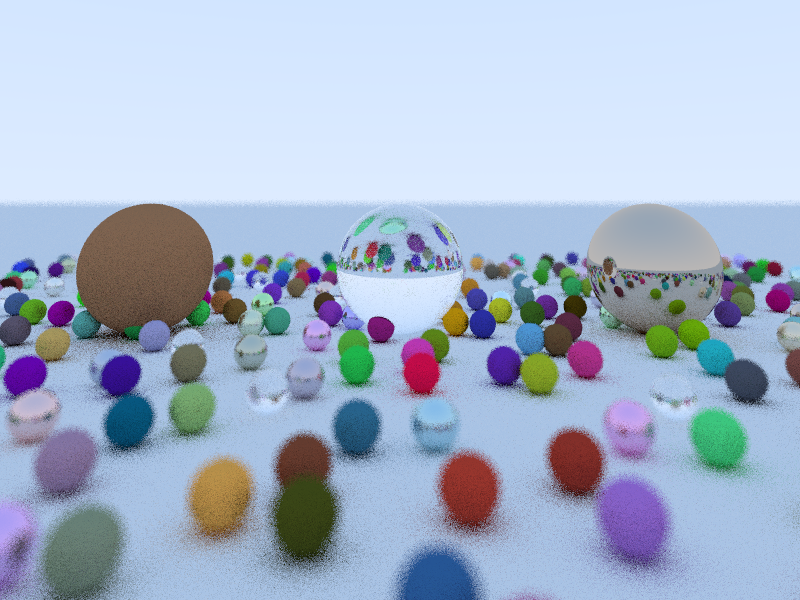

# Ray Tracing in a Weekend

A Rust implementation of the book [*Ray Tracing in a Weekend* by Peter Shirley](https://in1weekend.blogspot.com/).

Some parts of the next book *Ray Tracing: The Next Week* also implemented.

# Usage

Run the program with `cargo run --release`. You can also give it a JSON configuration file as an argument to change the render settings without having to recompile the program.

Example:  
`$ cargo run --release -- json/config/github_sample.json`  
or  
`$ target/release/rt1w json/config/github_sample.json`

# To Do

- Implement scene loading via JSON

# License

This project is licensed under the MIT license - see the [LICENSE.md](LICENSE.md) for details.
